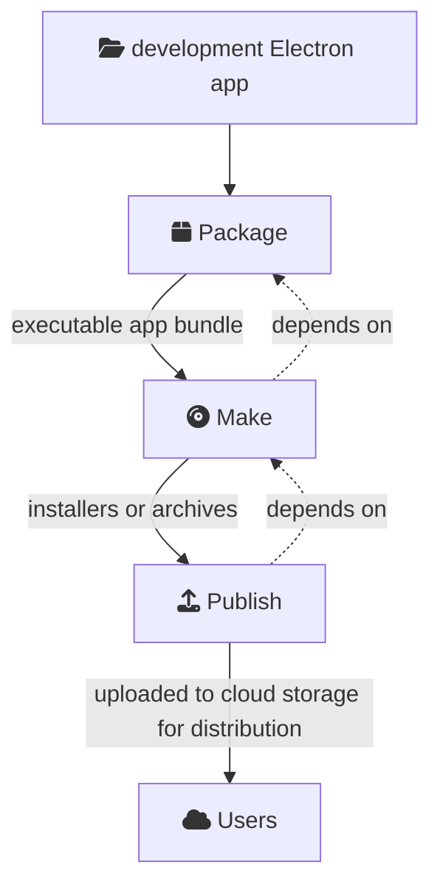

# Build Lifecycle

Once your app is ready to be released, Electron Forge can handle the rest to make sure it gets into your users' hands. The complete build flow for Electron Forge can be broken down into three smaller steps:

Each one of these steps is a separate command exposed through Forge's `electron-forge` command line interface, and is usually mapped to a script in your package.json file.

:::info
**Cascading build steps**

Running each of these tasks will also run the previous ones in the sequence (i.e. running the `electron-forge publish` script will first run `package` and `make` as prerequisite steps).
:::

## Step 1: Package

:::info
For command usage, see the [Package](../cli.md#package) CLI command documentation.
:::

In the Package step, Forge uses [Electron Packager](https://github.com/electron/electron-packager) to package your app. This means creating an executable bundle for a target operating system (e.g. `.app` on macOS or `.exe` on Windows).

This step also performs a few supporting tasks:

* Handles [code signing and notarization](../guides/code-signing/code-signing-macos.md) on macOS.
* Rebuilds native node add-ons for your app's Electron version.
* Handles [Custom App Icons](../guides/create-and-add-icons.md) on Windows and macOS.

By default, running the Package step will only create a packaged application for your machine's platform and architecture.

:::info
**On bundling app code**

Note that Forge does _not_ perform any bundling of your app code for production in the Package step without additional configuration.

If you need to perform any custom JavaScript build tasks (e.g. module bundling with Parcel or webpack) for either renderer or main process code, see the [Using lifecycle hooks](build-lifecycle.md#using-lifecycle-hooks) section below.
:::

:::tip
After the Package step, your packaged application will be available in the `/out/` directory.
:::

## Step 2: Make

:::info
For command usage, see the [Make](../cli.md#make) CLI command documentation.
:::

Forge's **Make** step takes the bundled executable output from the previous Package step and creates "**distributables**" from it. Distributables refer to any output format that you want to distribute to users, whether it be an OS-specific installer (e.g. `.dmg` or `.msi`) or a simple compressed archive (e.g. `.zip`) of the bundle.

You can choose which distributables you want to build by adding [Makers](../config/makers/index.mdx) to your Forge config.

By default, running the Make step will only run Makers targeting your machine's platform and architecture.

:::tip
After the Make step, distributable archives or installers are generated for your packaged app in the `/out/make/` folder of your project.
:::

## Step 3: Publish

:::info
For command usage, see the [Publish](../cli.md#publish) CLI command documentation.
:::

Forge's **Publish** step takes the distributable build artifacts from the Make step and uploads for distribution to your app's end users (e.g. to GitHub Releases or AWS S3 static storage). Publishing is an optional step in the Electron Forge pipeline, since the artifacts from the Make step are already in their final format.

You can choose which platforms you want to target by adding [Publishers](../config/publishers/index.md) to your Forge config.

:::tip
After the Publish step, your app distributables will be available to download by users.
:::

## Using lifecycle hooks

Your Electron application might have custom build needs that aren't handled with the most basic Forge pipeline described above. To solve this issue, Electron Forge exposes callback hooks at various points in the build process.

These hooks can be used to implement custom logic that your application needs. For instance, you can perform actions between the Package and Make steps with the `premake` hook.

:::info
For a full list of Forge hooks and usage examples, see the [Hooks](../config/hooks.md) documentation.
:::

If you want to share a specific sequence of build hook logic, you can modularize your hook code into a **plugin** instead. This is how Forge's [Webpack Plugin](../config/plugins/webpack.mdx) works, for instance. For more details on authoring custom plugins, see the [Writing Plugins](../advanced/extending-electron-forge/writing-plugins.md) guide.

## Cross-platform build systems

By default, Electron Forge will only build your app for the operating system it's running on. Targeting a different operating system (e.g. building a Windows app from macOS) has many caveats.

If you don't have access to Windows, macOS, and Linux machines, we highly recommend creating a build pipeline on a Continuous Integration platform that supports all these platforms (e.g. CircleCI or GitHub Actions). For an example of CI builds in action, see [Electron Fiddle's CircleCI pipeline](https://github.com/electron/fiddle/blob/main/.circleci/config.yml).
